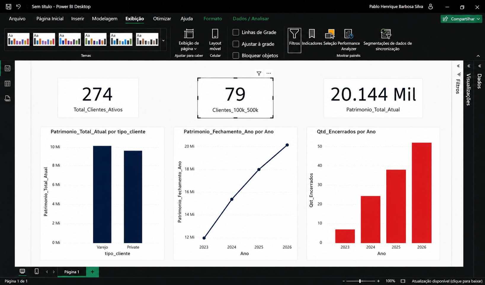
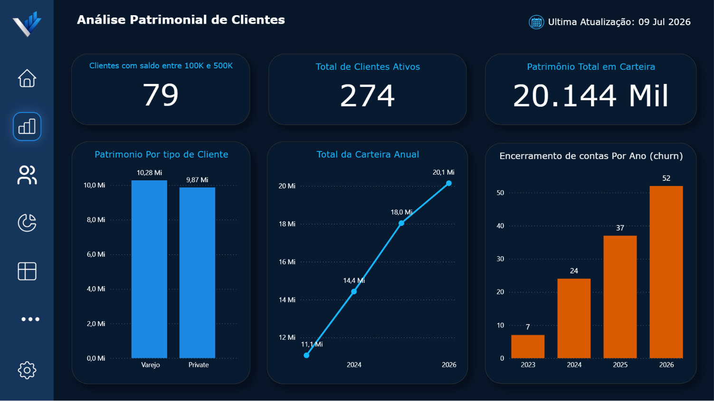

# 📊 Dashboard Patrimonial — Análise de Carteira de Clientes

Projeto de análise de dados end-to-end simulando o cenário de um banco/gestora de patrimônio, com o objetivo de responder perguntas de negócio sobre composição de carteira, aquisição e retenção de clientes, usando **Python, SQL e Power BI**.

## 🎯 Contexto e Objetivo

Este projeto foi construído como se eu fosse um analista de dados recém-contratado, recebendo do gestor a missão de estruturar uma base de dados de clientes. As perguntas de negócio abaixo foram formuladas por mim, simulando o tipo de questionamento estratégico que um gestor de carteira faria no dia a dia:

- Quantos clientes temos hoje, e quantos estão em uma faixa específica de patrimônio?
- Quantos clientes novos estamos captando?
- A carteira está saudável, ou existem riscos escondidos por trás dos números agregados?

O foco do projeto não é só "rodar queries", mas construir uma **narrativa analítica**: partir de perguntas simples e chegar a insights de negócio mais profundos, com o rigor de questionar as próprias conclusões ao longo do caminho.

## 🗂️ Estrutura do Projeto

```
├── gerar_dados.py          # Script Python que gera os dados sintéticos
├── clientes.csv             # Dados cadastrais dos clientes (500 registros)
├── saldos_mensais.csv       # Snapshots mensais de saldo e status (7.300 registros)
├── queries.sql               # Todas as queries SQL do projeto
└── analise_patrimonial.pbix  # Dashboard Power BI
```

## 🧱 Modelagem de Dados

O modelo foi desenhado em torno de uma decisão central: separar **dados fixos do cliente** de **dados que variam mês a mês**, para viabilizar análises de série temporal (evolução de patrimônio, churn ao longo do tempo).

**`clientes`** (dimensão — atributos fixos)
| Coluna | Tipo | Descrição |
|---|---|---|
| id_cliente | INTEGER (PK) | Identificador único |
| nome_cliente | TEXT | Nome do cliente |
| data_entrada | DATE | Data de entrada na base |
| tipo_cliente | TEXT | Varejo ou Private |

**`saldos_mensais`** (fato — snapshot mensal)
| Coluna | Tipo | Descrição |
|---|---|---|
| id_cliente | INTEGER (FK) | Referência ao cliente |
| data | DATE | Mês de referência do snapshot |
| valor_mes | REAL | Saldo do cliente naquele mês |
| status | TEXT | Ativo ou Encerrado |

Relacionamento **1:N** entre `clientes` e `saldos_mensais` — um cliente possui vários registros mensais de saldo, um por mês em que esteve na base.

## 🛠️ Stack utilizada

- **Python** (Faker) — geração de dados sintéticos realistas
- **SQLite** — modelagem relacional e queries de negócio
- **Power BI** (Power Query + DAX) — dashboard interativo

## ❓ Perguntas de Negócio Respondidas

| Pergunta | Resposta |
|---|---|
| Quantos clientes ativos temos hoje? | **274** |
| Quantos clientes têm saldo entre R$100k e R$500k? | **79** |
| Quantos clientes novos entraram entre mar-mai/2026? | **38** |
| Qual o patrimônio total da carteira hoje? | **R$ 20,14 milhões** |
| Como o churn evoluiu ao longo dos anos (1º semestre)? | 7 → 24 → 37 → 52 (2023-2026) |
| Como o patrimônio está distribuído entre Varejo e Private? | 51% Varejo / 49% Private |

## 💡 Principais Insights

**1. O churn está em tendência de piora consistente, não é um problema pontual.**
Comparando o primeiro semestre de cada ano (para eliminar o viés de anos incompletos), o número de encerramentos de conta mais que triplicou entre 2023 e 2026 (7 → 52), mostrando uma trajetória de crescimento acelerado, não uma flutuação isolada.

**2. O crescimento do patrimônio total mascara um risco de concentração.**
Apesar do churn crescente, o patrimônio total da carteira segue subindo ano a ano (R$11M em 2023 → R$20,1M em 2026). Isso acontece porque **57 clientes Private** (11% da base ativa) seguram **49% de todo o patrimônio** — um cliente Private tem, em média, patrimônio ~3,7x maior que um cliente Varejo. Isso significa que a carteira está exposta a um risco de concentração: a saída de poucos clientes de alto valor tem impacto financeiro desproporcional comparado à saída de um número maior de clientes Varejo.

**3. Comparações "brutas" entre períodos incompletos podem enganar.**
Uma primeira leitura dos dados de churn anual (32, 64, 78, 52) sugeriria que 2026 estava "melhorando" em relação a 2025. Ajustando a comparação para o mesmo intervalo de meses em ambos os anos, a conclusão se inverteu: o churn do 1º semestre de 2026 (52) já superou o do 1º semestre de 2025 (37) — uma piora real de ~40%.

## 🖥️ Dashboard

O dashboard foi construído para contar essa narrativa em camadas: visão geral (KPIs) → tendências (evolução de patrimônio) → risco (churn e concentração), todas as métricas validadas cruzando os resultados do SQL com as medidas DAX do Power BI.

### Evolução do design

| Antes | Depois |
|---|---|
|  |  |


## 🔁 Como Reproduzir

1. Rode `gerar_dados.py` para gerar `clientes.csv` e `saldos_mensais.csv`
2. Crie um banco SQLite e execute os `CREATE TABLE` + import dos CSVs (ver `queries.sql`)
3. Rode as queries de `queries.sql` para validar os números de negócio
4. Abra `analise_patrimonial.pbix` no Power BI Desktop, aponte a origem de dados para os CSVs gerados

## 📚 Aprendizados Técnicos

- Modelagem de dados fato/dimensão (PK/FK) para permitir análises históricas e evitar duplicação/inconsistência de atributos fixos do cliente
- Cuidado com viés de comparação entre períodos incompletos (ex: ano em andamento vs. anos fechados) — uma leitura ingênua dos números de churn anual sugeriria melhora, quando na verdade havia piora
- Validação cruzada entre SQL e DAX como prática de qualidade: cada medida do dashboard foi conferida contra o resultado da query SQL equivalente, o que revelou e corrigiu um erro real de importação de dados
- Bug de localidade no Power BI ao importar números com separador decimal americano (ponto) — corrigido definindo a coluna como "Número Decimal" com localidade "Inglês (Estados Unidos)" no Power Query
- Uso de CTE e JOIN em SQL, e o equivalente em DAX via contexto de filtro automático em relacionamentos 1:N
- Uso de `DISTINCTCOUNT` em vez de `COUNT` nas medidas DAX, como camada extra de segurança contra contagem duplicada de clientes

---
**Autor:** Pablo H. | [GitHub](https://github.com/pablohrnq)
